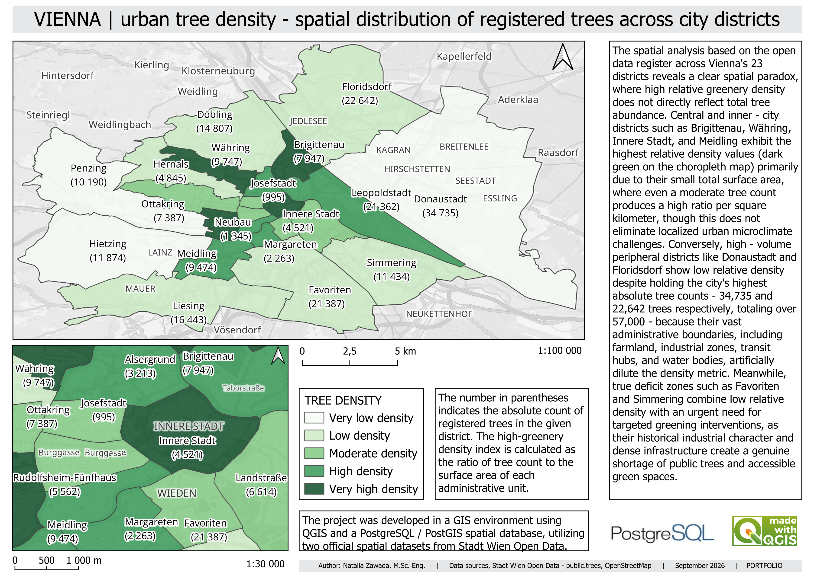
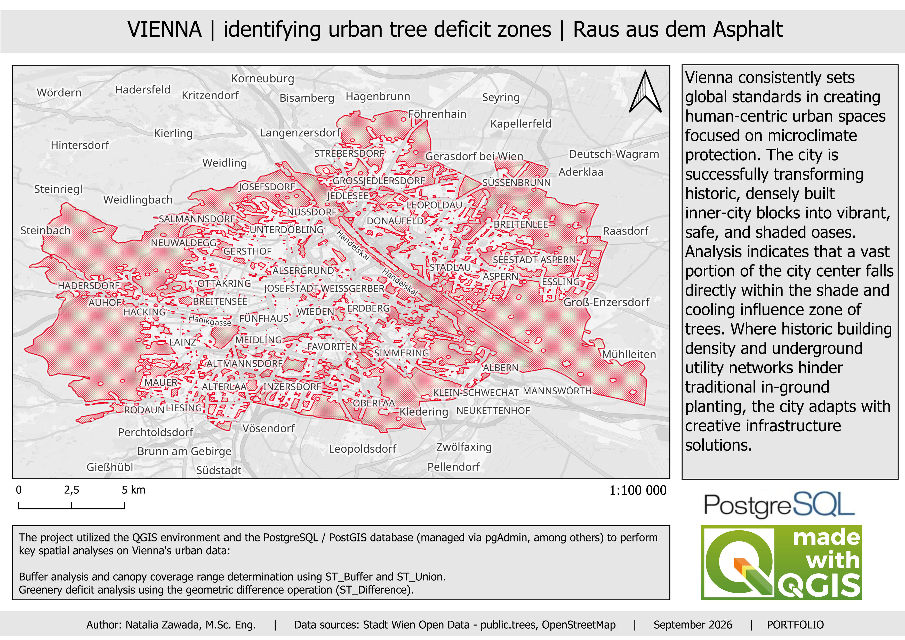

# Vienna Urban Tree Analysis

## Project Overview

This project analyses the spatial distribution of registered urban trees across the 23 districts of Vienna, Austria.

The analysis combines two complementary approaches:

1. **Urban Tree Density** - analysis of the relative distribution of registered trees across Vienna's administrative districts.
2. **Urban Tree Deficit Zones** - identification of areas with limited tree coverage based on a defined spatial tree-influence model.

The project demonstrates the application of GIS and spatial database technologies to the analysis of urban green infrastructure.

## Study Area

The study area covers all 23 administrative districts of Vienna, Austria.

## Data

* **Tree data:** Stadt Wien Open Data — public.trees
* **Additional spatial data:** OpenStreetMap
* **Administrative units:** Vienna's 23 districts
* **Study area:** Vienna, Austria

## Methodology

### 1. Urban Tree Density

The first analysis examines the spatial distribution of registered trees across Vienna's 23 districts.

For each district, a relative tree density indicator was calculated as the number of registered trees divided by the area of the administrative unit.

Both **absolute tree counts** and **relative tree density** were considered when interpreting the results. Large peripheral districts may contain a high number of registered trees while showing lower relative density because of their larger administrative area.

This demonstrates the importance of considering the spatial scale and characteristics of administrative units when interpreting density-based indicators.

### 2. Urban Tree Deficit Zones

The second analysis focuses on the spatial coverage of registered trees and the identification of potential tree-deficit areas.

Tree locations were used to create spatial influence zones using buffer analysis. Overlapping buffer geometries were then merged to represent the combined tree influence area.

Areas outside the resulting coverage were identified using a geometric difference operation.

The main spatial operations included:

* `ST_Buffer` - creation of tree influence zones
* `ST_Union` - merging of overlapping spatial geometries
* `ST_Difference` - identification of areas outside the analysed tree coverage

The resulting areas represent **potential tree-deficit zones according to the adopted spatial model**.

## Results

The analysis reveals substantial spatial differences in the distribution of registered trees across Vienna.

The tree density analysis shows that relative density does not always correspond to the absolute number of trees. Large districts can contain many registered trees while showing lower density values because of their extensive administrative areas.

The tree deficit analysis provides a complementary spatial perspective by identifying areas with limited coverage according to the defined tree-influence model.

Together, the analyses demonstrate the importance of combining **quantitative density indicators** with **spatial analysis** when assessing urban green infrastructure.

## Maps

### Map 1 - Urban Tree Density

The map presents the relative density of registered trees across Vienna's 23 districts. Absolute tree counts are also provided to support interpretation of the density values.

### Map 2 - Urban Tree Deficit Zones

The map presents potential tree-deficit areas identified through buffer, union and difference operations based on registered tree locations.

## Tools

* QGIS
* PostgreSQL
* PostGIS
* pgAdmin

## Spatial Analysis Techniques

* Density analysis
* Buffer analysis
* Spatial union
* Geometric difference
* Spatial aggregation
* Choropleth mapping

## Data Sources

* Stadt Wien Open Data - public.trees
* OpenStreetMap

## Author

**Natalia Zawada, M.Sc. Eng.**

September 2026
